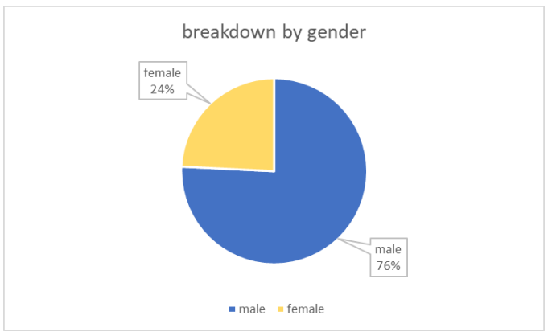

# explanatory-analysis-with-sql
The new_york_citibike dataset is about New York City's bike share system, it is made of two tables: citibike_stations and citibike_trips

## Part 1: meaningful indicators about the entire NY citibike system

#### Stations
The number of stations: 1584
Average capacity: 29.92
Maximum capacity: 91
Minimum capacity: 1
Number of regions covered: 3

#### Trips & customers
Average number of trips per week in the last full year of data


_The number of trips goes down in winter, which makes sense, because people ride bicycles less
during cold weather._

Average duration of trips in minutes: 16.04

Breakdown by gender:

| gender | number of customers | 
| :---:         |     :---:      |         
| female   | 11,376,412     | 
| male     | 35,611,787       | 



Average age of users: 44.52

## Part 2: evolution of the system between 2013 and 2018
Evolution of the number of trips per year, per month between 2013 and 2018.


_The number of trips has a high increase in 2016, which is followed by a drastic decline._


_This graph shows us the pattern of users’ behavior, since the line always goes up in March, and
goes down after September, when the weather gets colder._

Evolution of breakdown by gender between 2013 and 2018.


_There are more males than females who rent a Velib bike. In 2016 both males and females
started using bikes more, but starting from 2017 the figure decreases._

Evolution of customers by age


_Similarly, the number of clients increased in 2016 and 2018, and people aged from 35 to 44
made up the majority of the journeys in both years. Until 2016, those aged from 45 to 54 rented
more bikes, after which the number of people with age from 35 to 34 rented more bikes._

## Part 3: interesting bike stations in NYC
Stations that have the most starting points:

| start_station_id | number_of_trips | 
| :---:         |     :---:      |         
| 519     | 551078     | 
| 497     | 423334       | 
| 435   | 403795    | 
| 426     | 384116       | 
| 293     | 372255       | 

Stations that have the most ending points:

| end_station_id | number_of_trips | 
| :---:         |     :---:      |         
| 519     | 511019     | 
| 497     | 444460       | 
| 435   | 407982    | 
| 426     | 399033       | 
| 402     | 377854       | 

_Station number 519 is quite interesting, as most of the trips start and end there._

Stations with the highest capacity:

| station_id | capacity | 
| :---:         |     :---:      |         
| 248     | 91     | 
| 293     | 91       | 
| 470   | 84    | 
| 3687     | 83       | 
| 501     | 83       |

_The station with the highest capacity is Laight ST & Hudson St, with station id 248 and is
located in 71th region.
Surprisingely, the stations with highest capacity, don’t have the most trips_

Stations with the highest number of available bikes:
| station_id | capacity | 
| :---:         |     :---:      |         
| 445     | 79     | 
| 361     | 78       | 
| 3122   | 76    | 
| 247     | 76       | 
| 3410     | 76       |
_Station number 445 has the most available bikes and was the 8th station with highest capacity._

## Queries
number of stations
```
SELECT count(distinct station_id)
FROM `bigquery-public-data.new_york_citibike.citibike_stations`
```
average capacity
```
SELECT ROUND(AVG(capacity),2)
FROM `bigquery-public-data.new_york_citibike.citibike_stations`
```
maximum capacity
```
SELECT MAX(capacity)
FROM `bigquery-public-data.new_york_citibike.citibike_stations`
```
minimum capacity
```
SELECT MIN(capacity)
FROM `bigquery-public-data.new_york_citibike.citibike_stations`
WHERE (capacity !=0)
```
number of regions covered
```
SELECT count(distinct region_id)
FROM `bigquery-public-data.new_york_citibike.citibike_stations`
```
average number of trips per week in the last full year of data
```
SELECT
week,
ROUND(COUNT(*)/7,2) AS avg_trips_per_week
FROM (
SELECT
EXTRACT(WEEK FROM starttime) AS week,
EXTRACT(YEAR FROM starttime) AS year
FROM `bigquery-public-data.new_york_citibike.citibike_trips`
) AS t
WHERE year = 2014
GROUP BY week
ORDER BY week;
```
average duration of trips in minutes
```
SELECT AVG(tripduration/60)
FROM `bigquery-public-data.new_york_citibike.citibike_trips`
```
breakdown by gender
```
SELECT
gender, COUNT(*) AS number
FROM `bigquery-public-data.new_york_citibike.citibike_trips`
WHERE gender IN ("male", "female")
GROUP BY gender;
```
average age of users
```
SELECT
AVG((EXTRACT(YEAR FROM CURRENT_DATE) - birth_year)) AS age
FROM `bigquery-public-data.new_york_citibike.citibike_trips
```
Evolution of the number of trips per year, per month
```
SELECT
PARSE_DATE('%d/%m/%Y',CONCAT('01', "/", month,'/', year)) as Date,
number_of_trips
FROM
(SELECT
year,
month,
COUNT(*) AS number_of_trips
FROM (
SELECT
EXTRACT(YEAR FROM starttime) AS year,
EXTRACT(MONTH FROM starttime) AS month
FROM `bigquery-public-data.new_york_citibike.citibike_trips`
WHERE starttime IS NOT NULL AND gender IS NOT NULL
) AS t
GROUP BY year, month
HAVING year BETWEEN 2013 AND 2018
ORDER BY year, month
) AS t2;
```
Evolution of breakdown by gender
```
SELECT
year,
COUNT(case WHEN gender = "male" then 1 end) as num_males,
COUNT(case WHEN gender = "female" then 1 end) as num_females
FROM (
SELECT gender,
starttime,
EXTRACT(YEAR FROM starttime) AS year
FROM `bigquery-public-data.new_york_citibike.citibike_trips`
WHERE starttime IS NOT NULL AND gender IS NOT NULL) AS t
GROUP BY year
HAVING year BETWEEN 2013 AND 2018
ORDER BY year;
```
Evolution of customers by age
```
SELECT
year,
COUNT(case WHEN age BETWEEN 20 AND 24 then 1 end) as age_20_24,
COUNT(case WHEN age BETWEEN 25 AND 34 then 1 end) as age_25_34,
COUNT(case WHEN age BETWEEN 35 AND 44 then 1 end) as age_35_44,
COUNT(case WHEN age BETWEEN 45 AND 54 then 1 end) as age_45_54,
COUNT(case WHEN age BETWEEN 55 AND 64 then 1 end) as age_55_64,
COUNT(case WHEN age BETWEEN 65 AND 74 then 1 end) as age_65_74
FROM (
SELECT
EXTRACT(YEAR FROM starttime) AS year,
(2022 - birth_year) AS age
FROM `bigquery-public-data.new_york_citibike.citibike_trips`
) AS t
GROUP BY year
HAVING year BETWEEN 2013 AND 2018
ORDER BY year;
```
Stations with the most starting point
```
SELECT start_station_id,
COUNT(*) AS number
FROM `bigquery-public-data.new_york_citibike.citibike_trips`
WHERE start_station_id IS NOT NULL
GROUP BY start_station_id
ORDER BY number DESC
LIMIT 20;
```
Stations with the most ending point
```
SELECT end_station_id,
COUNT(*) AS number
FROM `bigquery-public-data.new_york_citibike.citibike_trips`
WHERE end_station_id IS NOT NULL
GROUP BY end_station_id
ORDER BY number DESC
LIMIT 20;
```
Stations with the highest capacity
```
SELECT station_id,
capacity
FROM `bigquery-public-data.new_york_citibike.citibike_stations`
ORDER BY capacity DESC
LIMIT 20;
```
Stations with highest number of available bikes
```
SELECT
station_id,
num_bikes_available
FROM `bigquery-public-data.new_york_citibike.citibike_stations`
ORDER BY num_bikes_available DESC
LIMIT 20;
```
